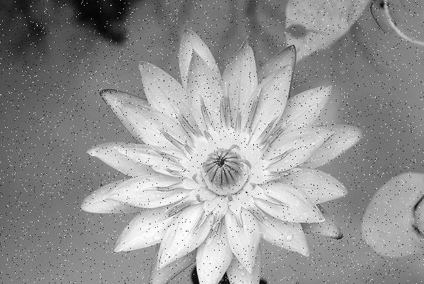

# Salt and Pepper for CUDA

## Overview

Salt and Pepper algorith for CUDA. For work with images, program uses EasyBMP.

## System configuration

| Name  | Values  |
|-------|---------|
| CPU  | AMD Ryzen 5 3600X, BOX |
| RAM  | 8 GB DDR4 |
| GPU  | Gigabyte GeForce GTX 1050 Ti|
| OS   | Windows 10 64-bit  |

## Results

Image input:

Image output:

